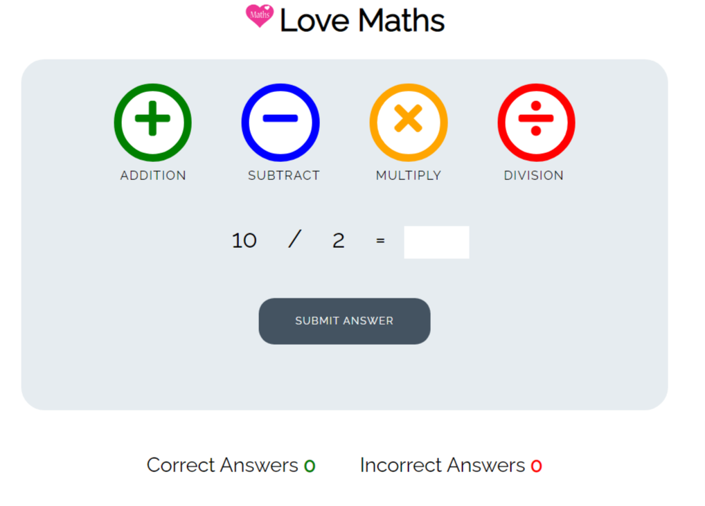

-**A puzzle game called Love Maths.**

You can view the live game [(here!)](https://perfecttennails.github.io/love-maths/)

A math quiz to test the users knowledge on addittion, subtraction, multiplication and division.

This is the responsive look.

-**Quiz Page**
- the quiz has 25 questions in each math section.
- The users total score of correct and wrong answers are displayed at the bottom.

This is the Subtraction 

This is the Addition 

This is the Multiplication 

This is the Division 

- **Navigation**
  - The navigation consists of 4 simple buttons at the top of the box.

  - Clicking the buttons will take the user to the selected math page.

  - The button named 'Submit Answer' when
clicked will cause a pop up box after submiting every answer, congratulating if it is correct or showing the correct answer if it is wrong, click ok to continue to the next question.

### Testing

- I have tested that this website is responsive, looks good and works as intended on the different standard screen sizes, using the devtools device toolbar in Google Chrome.

- I have tested that this website works in different browsers: Chrome, Safari, Firefox, Microsot Edge.

- I have confirmed that the quiz is fully functional. The different buttons do what they're supposed to do and trigger their respective functions.

### Validator Testing
- HTML
    - No errors were found when passing through the official [W3C Validator](https://validator.w3.org/nu/)

- CSS
    - No errors were found when passing through the official [(Jigsaw) Validator](https://jigsaw.w3.org/css-validator/)

- JavaScript
    - No errors were found when passing through the [JSHint Validator](https://jshint.com/)

### Unfixed Bugs
No unfixed bugs

## Deployment

- The site was deployed to GitHub pages. The steps to deploy are as follows:
    - In the GitHub repository, navigate to the Settings tab
    - From the source section drop-down menu, select the Master Branch
    - Once the master branch has been selected, the page will be automatically refreshed with a detailed ribbon display to indicate the successful deployment.
